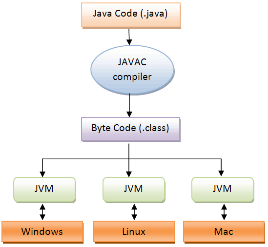

## JVM의 구조

#### JVM(Java Virtual Machine) 자바가상머신

Java 파일을 compile 하는 과정을 거치면, Byte 코드로 이루어진 class 파일이 만들어진다. 

JVM 은 해당 바이트 코드를 읽으면서 필요한 부분에 대해 메모리에 올리는 작업을 하게 된다.

JVM내부에서도 여러가지 구조가 나뉘어져있는데, 각각은 다음과 같은 역할을 한다.

* **Class Loader**

  * Byte 코드(클래스파일) 을 읽어 메모리에 올리는 역할을 한다.

* **메모리**

  * 스택, Heap, 메서드 영역으로 나뉘어진다.
    * 스택 영역 : 메서드 호출을 스택프레임이라고 부르는 블럭으로 쌓는다.
    * Heap : 객체를 저장한다.
    * 메서드 영역 : 클래스 수준의 정보를 저장한다.  (Class 의 이름, 부모클래스의 이름, method 의 지역변수 등)

* **실행엔진**

  * 인터프리터가 Byte코드를 한줄씩 실행하며 그 중 반복되는 부분에 대한 처리는 JIT 컴파일러에서 처리를 한다.

  ​

#### Class Loader

Class Loader는 3개의 과정으로 이루어지는데, 로딩, 링크, 초기화의 과정을 거친다.

* 로딩
  * Class 파일을 읽어 적절한 바이너리 데이터를 만들어, 메모리의 '메서드' 영역에 저장한다.
  * Class Loader는 Bootstrap Loader <- Extension Loader <- Application Loader 3개의 계층구조로 이루어져 있다. 상위의 클래스로더가 해당 클래스를 읽지 못한다면 하위 Loader가 읽는 식으로 Class 를 읽는과정이 이뤄진다.
    * 만약 이 상황에서 Class 를 찾을 수 없을 때 발생하는 예외가 바로 ClassNotFoundException 이다.
  * 로딩의 과정이 끝나면, 해당 클래스타입의 Class 객체를 생성한다. (클래스이름.class 로 접근 가능한 객체)
* 링크
* 초기화
  * static 변수의 값을 할당한다.