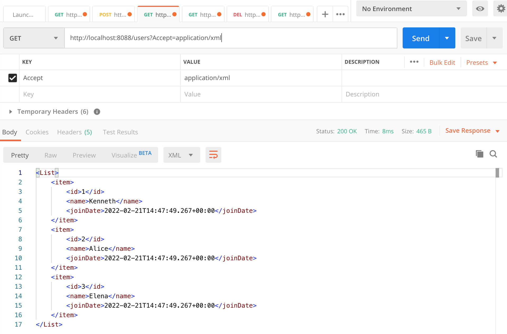

## Rest API Xml 타입으로 Response 받기

```xml
<dependency>
	<groupId>com.fasterxml.jackson.dataformat</groupId>
	<artifactId>jackson-dataformat-xml</artifactId>
  <version>2.10.2</version>
</dependency>		
```

* 기존의 json 방식으로 Response 하는 api 를 xml 형태로도 받고 싶다면, 다음과 같은 의존성을 추가해주어야 한다.


