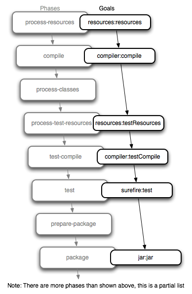

### 메이븐(Maven)

#### 메이븐이란?

##### 빌드

* **빌드**란, 우리가 작성한 소스코드나, 프로젝트에서 쓰인 각각의 파일 및 자원 들을 JVM 또는 톰캣과 같은 WAS 가 인식할 수 있는 구조로 패키징 하는 과정 및 결과물

##### 메이븐은 빌드툴이다

* 프로젝트 생성 및 테스트 빌드, 배포 등의 작업을 위한 프로그램
* 빠른 기간 동안 계속해서 늘어나는 라이브러리 추가, 라이브러리 버전의 관리 등을 해결하기 위함

#### 메이븐 Lifecycle

* 메이븐이 프로젝트를 관리하는 정해진 순서가 존재하며 이를 Lifecycle 이라고 함.

* clean, build, site 의 세 가지의 Lifecycle 을 제공

* **phase** 란, Build Lifecycle 의 각각의 단계를 의미한다. ex) package phase
* phase 는 단계별 의존성을 가지고 있어서, 이전 단계의 phase 가 끝나야 다음단계의 phase 를 수행할 수 있다.
  * clean install 을 수행하면, install 까지의 과정이 모두 수행됌.
* **goal**이란, 각 phase들이 실제 수행하는 작업. task를 의미한다.

------

Jenkins 프로젝트에서는, Maven 을 AWS EC2 ubuntu 서버에 깔지 않고, Jenkins 에서 maven 을 Install 하도록 설정해주었음.

* Jenkins 관리 > Global Tool Configuration

* Maven 설정

* Jenkins 프로젝트의 구성에서 Build 시 Maven 설정

 

**Maven Version** 

* Jenkins 설정에 기입해준 Maven 버전을 선택 가능

**Goals** 

어떤 작업을 수행할 것인지를 기입해주면 되는데, 나의 경우는 clean install 로 적어주었다. 

-DskipTests=true 속성의 경우는, Junit 테스트를 건너뛰겠다는 의미

-DfinalName 의 경우, 최종적으로 만들어지는 war/jar 파일의 이름을 ROOT 로 하겠다는 의미이다.

