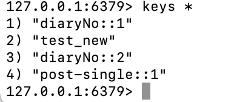
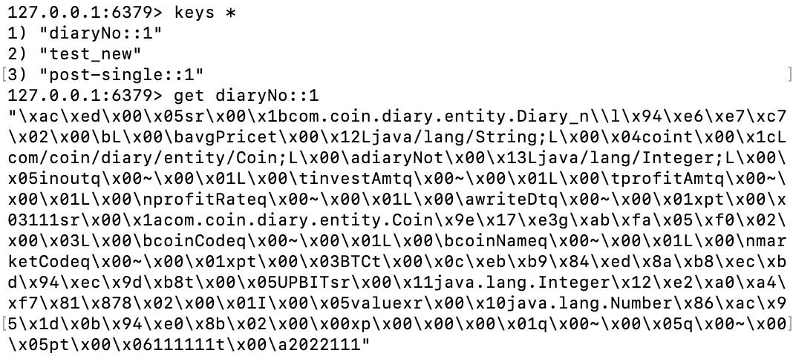
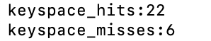

## Redis

* key, value 형식으로 데이터를 저장할 수 있는 In-memory Nosql DB

#### 장점 및 특징

- 인메모리db - 빠르다. 빠른 IO속도를 보장하는 NoSql 이다.
- String, Set, Sorted Set, Hash, List 등의 다양한 데이터형식을 지원한다. (비슷한 memcached 는 String 형의 데이터 형식만을 지원한다)
- 다양한 기능을 제공한다
- 읽기 성능 증대를 위해 서버 Reflication 을 지원한다(서버 복제)

#### 단점

* In-memory 방식이라 장애발생시 데이터가 유실될 수 있다.
* 영속적인 데이터 보존을 위한 스냅샷, AOF 기능을 통한 복구방식을 주의해서 작성해야 데이터 유실에 대비할 수 있다.

#### redis 기능

* in-memory 캐싱
* pub/sub 메세지 큐
* 세션 스토어

#### Java와 Redis 연동

1. 추상화된 API와 어노테이션 제공
2. SpringBoot 의 AutoConfiguration 적용으로 Cache 서버 설정이 간결하다
-> spring-boot-starter-data-redis
3. @Cacheable, @CacheEvict, @CachePut 등의 어노테이션을 메서드(Controller 혹은 Service의 메서드)에 등록하여 redis 서버를 캐시로 구성가능함.

##### Redis Cache 의 사용자 구성

* 캐시의 TTL적용하거나 임의시점의 캐시 등록/삭제 기능을 사용하고 싶을 땐 직접 Configuration 설정을 해주어야 한다.

#### 연동방법

1. 의존성 추가

```xml
<!-- redis -->
<dependency>
	<groupId>org.springframework.boot</groupId>
	<artifactId>spring-boot-starter-data-redis</artifactId>
</dependency>
```

2. Redis 접속정보 설정 (application.properties)

```properties
spring.cache.type=redis
spring.redis.host=localhost
spring.redis.port=6379
```

3. 어노테이션 설정

```java
	@Cacheable(value="diaryNo", key="#diaryNo")
	@Override
	public Diary find(Integer diaryNo) {
		// TODO Auto-generated method stub
		return diaryRepository.findById(diaryNo).get();
	}
```

* 위와 같이, @Cacheable 어노테이션을 통해 캐시를 적용하면, diaryNo#1(key값) 와 같은 형태로 캐시가 등록된 것을 확인할 수 있다.



* 어노테이션 적용 후 두번째 동일한 메서드 호출 시, 쿼리가 콘솔에 표시되지 않았다. (H2 DB 가 아닌 redis 에서 가져온 객체를 표시했다는 것.)

4. 등록된 데이터 확인




#### Cache Hits

* cache 적용 시, cache 된 데이터 요청 시, 해당 키 값을 잘 찾은 비율이다.
  * 반대되는 개념은, Cache Misses이다.

redis-cli에서 "info stats"를 입력 후 



해당 정보로 cache hits 비율을 계산 가능하다.

* cache hits 비율이 높을수록, 캐시기능을 잘 사용하고 있다는 의미이다. 
  * 다만, cache hits 비율을 높이고 싶다고 해서 cache를 영구적으로 계속 저장해두면 리소스를 차지해 문제가 생길 수 있다.

* 적절한 ttl 을 설정해, 캐시가 일정한 주기로 만료되어 삭제될 수 있게 관리해주어야 한다. 
  * ttl 을 어떻게 설정할 것인지 등의 사안에 대해서는 적용할 시스템에 맞게끔 상황에 따라 선택해야할 문제이다.


참고링크들

[(Redis) Redis란? 우아한 Redis 발표영상 후기](https://lion-king.tistory.com/entry/Redis-what-is)